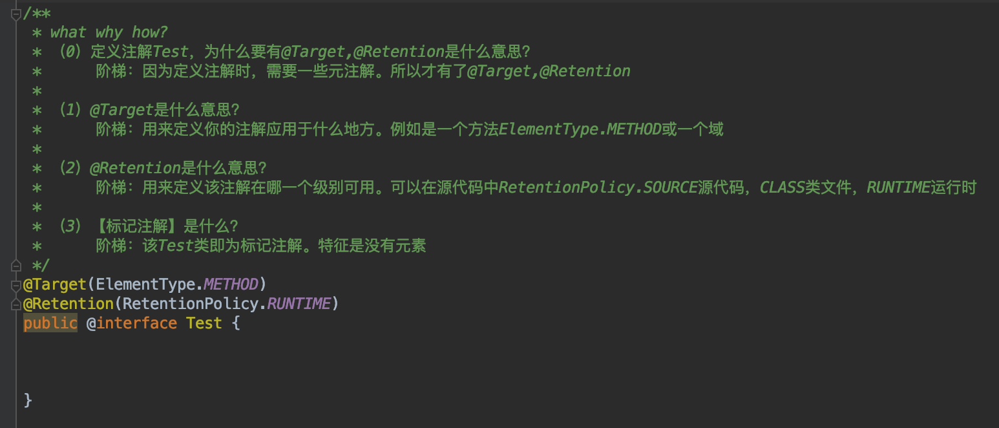

# 编程思想之注解

笔者喜欢从三个角度来写技术文章。`what`，`why`，`how`。

讲我理解的注解前，首先简单看下`java`自己提供的`Junit`注解单元测试框架。`@Test`就是实现了`Annotation`的`注解`，用于单元测试

```java
public class Testable {

    public static void execute() {
        System.out.println("Executing...");
    }

    @Test
    public void testExecute2() {
        System.out.println("testExecute2...");
        execute();
    }

    @Test
    public void testExecute1() {
        System.out.println("testExecute1...");
        execute();
    }

}
```


## 我理解的注解

文章中的所有代码可参考仓库代码。

### 一.注解的概念

> 注解是什么

注解又称为标注，标记。是jdk5.0引入的一种注释机制，是代码里的特殊标记。

> 为什么要引入注解

由于这些标记可以在编译，类加载，运行时被读取，并执行相应操作。通过使用注解可以在不改变原有逻辑的情况下，在源文件中添加，例如：补充信息，代码分析工具，开发工具，部署工具，可以更新这些信息进行验证和部署。

> 怎么使用注解

Annotation就像Java修饰符一样，可以用于修饰包、类、构造器、方法、变量、参数、局部变量，这些信息存储在Annotation的"name=value“中。
Annotation对程序的运行无影响，如果希望Annotation在运行时其到作用，就需要通过配套工具对annotation中的信息进行访问处理，这一工具统称为APT注解处理工具。

### 1.标记注解`


> 代码示例是一个简单的自定义注解。

```java
@Target(ElementType.METHOD)
@Retention(RetentionPolicy.RUNTIME)
public @interface Test {
}
```

首先使用@interface修饰定义一个注解Test。

然后@Target用来定义你的注解应用于什么地方。例如是一个方法ElementType.METHOD或一个域

最后@Retention用来定义该注解在哪一个级别可用。可以在源代码中RetentionPolicy.SOURCE源代码，CLASS类文件，RUNTIME运行时

**说明：**该Test注解为**标记注解**。此类注解的特征是没有元素。


### 2.非标记注解`

> 2.1自定义`非标记注解`

```java
/**
 * what why how?
 * （1）【非标记注解】是什么？
 * 阶梯：该UseCase类即为标记注解。特征是有元素，如id和description
 * 用来：用来跟踪一个项目中的用例。
 * （2）id和description元素的使用。
 * 阶梯：id和description非方法，而是key-value形式的键值对中的key。
 * 用来：用来标记【目标方法】时提供【处理时提供的统一参数】，具体使用参考PasswordUtil
 */
@Target(ElementType.METHOD)
@Retention(RetentionPolicy.RUNTIME)
public @interface UseCase {

    public int id();

    public String description() default "no description";

}
```

> 2.2注解作用于`@Target(ElementType.METHOD)`方法的使用体现

```java
public class PasswordUtil {

    @UseCase(id=47,description ="Password must contain at least one numeric")
    public boolean validatePassword(String password){
        return (password.matches("\\w*\\d\\w*"));
    }


    @UseCase(id=48)
    public boolean encryptPassword(String password){
        return (password.matches("\\w*\\d\\w*"));
    }

    @UseCase(id=49,description = "new password can`t equal previously used ones")
    public boolean checkNewPassword(String password){
        return (password.matches("\\w*\\d\\w*"));
    }

}
```

> `APT`注解处理工具的简单实现

```java
public class UseCaseTracker {

    public static void trackUseCases(List<Integer> useCases, Class<?> cl) {
        for (Method m : cl.getDeclaredMethods()) {
            UseCase useCase = m.getAnnotation(UseCase.class);
            if (useCase != null) {
                System.out.println("Found Use Case:" + useCase.id());
                useCases.remove(new Integer(useCase.id()));
            }
        }
        for (int i : useCases) {
            System.out.println("warning:Missing use case"+i);
        }
    }

    public static void main(String[] args) {
        List<Integer> usecases = new ArrayList<>();
        Collections.addAll(usecases, 47, 48, 49, 50);
        trackUseCases(usecases, PasswordUtil.class);
    }

}
```

1. 获取待处理的目标类`Class`对象。如`PasswordUtil.class`

2. 获取该Class对象的所有的可访问的方法`List<Method>`。如`clazz.getDeclaredMethods()`

   ```java
   getDeclaredMethod() 获取的是类自身声明的所有方法，包含public、protected和private方法。
   getMethod () 获取的是类的所有共有方法，这就包括自身的所有public方法，和从基类继承的、从接口实现的所有public方法。
   ```

3. 获取`Method`对象的注解标识。如`method.getAnnotation(UseCase.class)`

4. 若该标识不为null。对其进行处理。

## 手码代码的思路梳理

#### 自定义注解
1. 定义注解类：通过`@interface`定义注解类
2. 定义注解类型：通过`@Target(ElementType.)`定义注解类型，常用可选择的类型为`type`，`method`，`field`
3. 定义注解运行范围：通过`@Retention(RetentionPolicy.)` 定义

#### 自定义注解处理器

1. 获取待处理的目标类`Class`对象。如`PasswordUtil.class`
2. 获取该Class对象的所有的可访问的方法`List<Method>`。如`clazz.getDeclaredMethods()`
3. 获取`Method`对象的注解标识。如`method.getAnnotation(UseCase.class)`
4. 若该标识不为null。对其进行处理。


## 核心概念参考

1. 什么是注解【概念】？注解的优势【存在价值】？

   如上。

2. 自定义注解的步骤？

   如上。

3. 注解Annotation与Class，Method，Field的继承关系？

   ```
   Class，Method，Field继承了AnnotatedElement注解接口。持有了如下方法
   
   <T extends Annotation> T getAnnotation(Class<T> annotationClass);
   ```

4. @Target注解的标记类型有哪几种？

   10种。常用的有ElementType.TYPE，ElementType.FIELD，ElementType.METHOD

5. @Retention注解的生效时间有哪几种？

   ```java
   
       /**
        * RetentionPolicy.SOURCE
        * RetentionPolicy.RUNTIME
        * RetentionPolicy.RUNTIME
        */
   public enum RetentionPolicy {
       /**
        * Annotations are to be discarded by the compiler.
        * 编译时，被编译器丢弃。
        */
       SOURCE,
   
       /**
        * Annotations are to be recorded in the class file by the compiler
        * but need not be retained by the VM at run time.  This is the default
        * behavior.
        * 被编译器记录到class文件内，运行时不会保留它
        */
       CLASS,
   
       /**
        * Annotations are to be recorded in the class file by the compiler and
        * retained by the VM at run time, so they may be read reflectively.
        * 运行时被保留
        * @see java.lang.reflect.AnnotatedElement
        */
       RUNTIME
   }
   ```